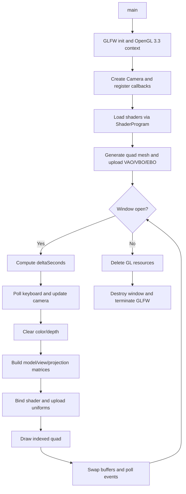
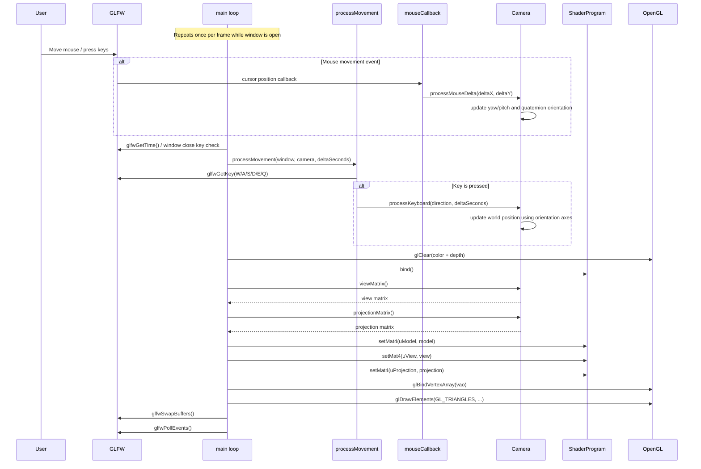

# Phase 1 Implementation Architecture

This document describes the current code architecture implemented for Phase 1 (Environment Setup and 3D Foundations).

## 1. Files Created

The following implementation files were created as part of Phase 1 scaffolding.

### Build and Configuration

- `CMakeLists.txt`

### Public Headers

- `include/spatial/Camera.hpp`
- `include/spatial/Geometry.hpp`
- `include/spatial/ShaderProgram.hpp`

### Source Files

- `src/main.cpp`
- `src/Camera.cpp`
- `src/Geometry.cpp`
- `src/ShaderProgram.cpp`

### Shader Assets

- `shaders/basic.vert`
- `shaders/basic.frag`

## 2. Classes and Functions in Each File

### CMakeLists.txt

Role:
- Defines the `spatial_player` C++17 executable.
- Locates OpenGL, GLFW, GLM, and FFmpeg (via pkg-config).
- Adds compile warnings (`-Wall -Wextra -Wpedantic`) when enabled.
- Copies `shaders/` to the build directory for runtime shader loading.

Primary CMake constructs:
- `project(spatial_player ...)`
- `find_package(...)`
- `pkg_check_modules(FFMPEG ...)`
- `add_executable(spatial_player ...)`
- `target_link_libraries(...)`

### include/spatial/Camera.hpp

Types:
- `enum class CameraMove`
	- Directions: `Forward`, `Backward`, `Left`, `Right`, `Up`, `Down`.

Class:
- `class Camera`

Public methods:
- `Camera(float width, float height)`
- `void processKeyboard(CameraMove move, float deltaSeconds)`
- `void processMouseDelta(float deltaX, float deltaY)`
- `glm::mat4 viewMatrix() const`
- `glm::mat4 projectionMatrix() const`
- `glm::vec3 position() const`

Private methods:
- `void clampPitch()`

State:
- Position, orientation quaternion, yaw/pitch, movement and mouse parameters, and projection parameters.

### src/Camera.cpp

Implements `spatial::Camera` behavior.

Internal constants (anonymous namespace):
- `kMaxPitchDeg`
- `kWorldUp`

Function behavior:
- `Camera::Camera(...)`
	- Initializes camera defaults and computes initial orientation.
- `Camera::processKeyboard(...)`
	- Moves camera in local forward/right/up axes based on frame delta time.
- `Camera::processMouseDelta(...)`
	- Updates yaw and pitch using sensitivity, clamps pitch, rebuilds quaternion orientation.
- `Camera::viewMatrix() const`
	- Uses `glm::lookAt` from current pose.
- `Camera::projectionMatrix() const`
	- Uses perspective projection.
- `Camera::position() const`
	- Returns world-space camera position.
- `Camera::clampPitch()`
	- Prevents over-rotation beyond +/-89 degrees.

### include/spatial/Geometry.hpp

Types:
- `struct MeshData`
	- `std::vector<float> vertices`
	- `std::vector<std::uint32_t> indices`

Factory functions:
- `MeshData createTexturedQuad()`
- `MeshData createInvertedSphere(std::uint32_t latitudeSegments, std::uint32_t longitudeSegments, float radius)`

### src/Geometry.cpp

Implements mesh generation.

Functions:
- `createTexturedQuad()`
	- Creates a 4-vertex quad with position + UV layout.
	- Emits 2 triangles via index buffer.
- `createInvertedSphere(...)`
	- Validates segment/radius inputs.
	- Generates sphere vertices using latitude-longitude parameterization.
	- Writes inverted winding order for inside-facing rendering (360 view use case).

### include/spatial/ShaderProgram.hpp

Class:
- `class ShaderProgram`

Special member behavior:
- Copy operations deleted.
- Move constructor and move assignment enabled.
- Destructor releases OpenGL program.

Public methods:
- `bool loadFromFiles(const std::string& vertexPath, const std::string& fragmentPath, std::string& errorMessage)`
- `void bind() const`
- `void setMat4(const std::string& uniformName, const glm::mat4& value) const`
- `unsigned int id() const`

### src/ShaderProgram.cpp

Implements shader loading, compilation, linking, and uniform updates.

Internal helper functions (anonymous namespace):
- `std::string readTextFile(const std::string& path)`
	- Reads whole shader file into memory.
- `unsigned int compileStage(unsigned int stageType, const std::string& source, std::string& errorMessage)`
	- Compiles one shader stage and returns shader handle or 0 on failure.

Class method implementations:
- `~ShaderProgram()`
	- Deletes GL program if created.
- `ShaderProgram(ShaderProgram&& other) noexcept`
- `ShaderProgram& operator=(ShaderProgram&& other) noexcept`
	- Transfers GL program ownership.
- `loadFromFiles(...)`
	- Reads source files, compiles vertex/fragment, links program, reports errors.
- `bind() const`
	- Activates the GL program.
- `setMat4(...) const`
	- Finds uniform location and uploads matrix if present.
- `id() const`
	- Returns raw program handle.

### src/main.cpp

Role:
- Contains application startup, OpenGL setup, input registration, mesh upload, render loop, and shutdown.

Internal types/functions (anonymous namespace):
- `struct InputState`
	- Tracks first-mouse state and last cursor position.
	- Holds a `spatial::Camera*` used by callbacks.
- `InputState gInputState`
	- Global callback bridge state.
- `void framebufferSizeCallback(GLFWwindow*, int width, int height)`
	- Updates viewport on resize.
- `void mouseCallback(GLFWwindow*, double xpos, double ypos)`
	- Converts cursor deltas into camera look updates.
- `void processMovement(GLFWwindow* window, spatial::Camera& camera, float deltaSeconds)`
	- Polls keyboard movement keys (W/A/S/D/E/Q) and moves camera.

Entry point:
- `int main()`
	- Initializes GLFW and OpenGL context.
	- Creates camera and shader program.
	- Generates quad mesh, uploads VAO/VBO/EBO.
	- Runs frame loop (input -> update -> render -> swap/poll).
	- Releases GL objects and terminates GLFW.

### shaders/basic.vert

Stage:
- Vertex shader.

Inputs:
- `aPos` (vec3 position)
- `aUv` (vec2 texture coordinates)

Uniforms:
- `uModel`, `uView`, `uProjection`

Outputs:
- `vUv`

Behavior:
- Applies MVP transform and forwards UV to fragment stage.

### shaders/basic.frag

Stage:
- Fragment shader.

Inputs/Outputs:
- Input: `vUv`
- Output: `FragColor`

Behavior:
- Produces a simple UV-based color gradient for visual validation.

## 3. Program Control Flow

The executable currently follows a classic game/render loop architecture:

1. Initialization
- `main()` initializes GLFW.
- Requests OpenGL 3.3 Core profile.
- Creates window and current context.
- Registers resize callback.
- Enables depth testing.
- Creates camera and registers mouse callback.
- Loads/compiles/links shaders via `ShaderProgram::loadFromFiles`.
- Builds quad geometry and uploads VAO/VBO/EBO buffers.

2. Per-Frame Loop
- Compute `deltaSeconds` from `glfwGetTime()`.
- Handle immediate exit key (`ESC`).
- Apply movement input (`processMovement`).
- Clear frame/depth buffers.
- Bind shader.
- Compute matrices:
	- `model = identity`
	- `view = camera.viewMatrix()`
	- `projection = camera.projectionMatrix()`
- Upload uniforms (`uModel`, `uView`, `uProjection`).
- Draw indexed quad (`glDrawElements`).
- Present frame (`glfwSwapBuffers`) and process events (`glfwPollEvents`).

3. Callback-Driven Input Path
- Mouse movement triggers `mouseCallback`.
- `mouseCallback` computes deltas and calls `camera.processMouseDelta(...)`.
- Keyboard movement is polled each frame inside `processMovement(...)`, calling `camera.processKeyboard(...)`.

4. Shutdown
- Exit loop when window should close.
- Delete GL buffers and vertex array.
- Destroy GLFW window.
- Terminate GLFW.

## Runtime Flow Diagram

## Input-to-Draw Sequence Diagram

## Module Interaction Summary

- `main.cpp` orchestrates lifecycle and frame loop.
- `Camera` provides view/projection transforms and movement/orientation updates.
- `Geometry` provides CPU-side mesh generation data.
- `ShaderProgram` encapsulates shader lifecycle and uniform binding.
- Shaders consume mesh attributes + camera transforms to produce final pixels.
