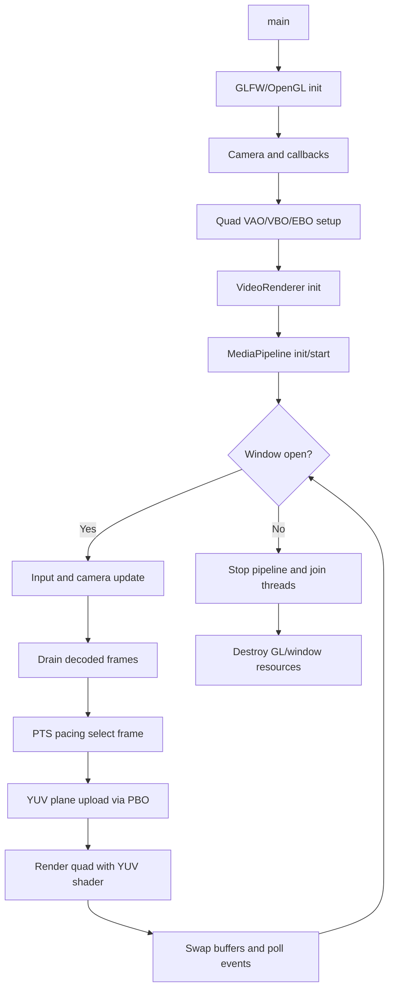
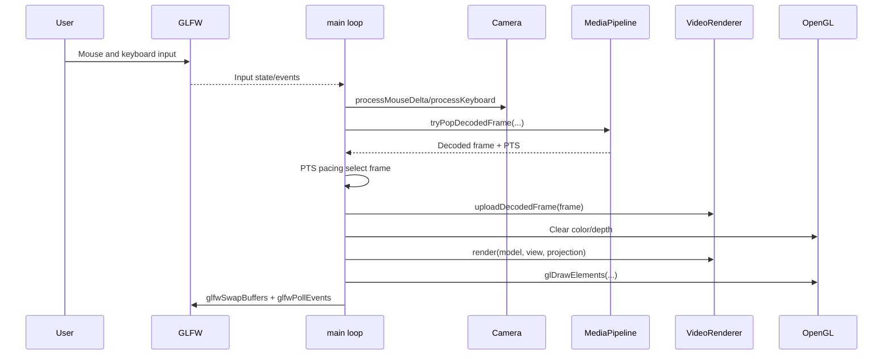

# Implementation Architecture (Phase 1-3)

This document describes the current architecture implemented across Phase 1 (3D foundations), Phase 2 (demux/decode pipeline), and Phase 3 (YUV texture upload and shader rendering).

## 1. Files Implemented

### Build and Configuration

- `CMakeLists.txt`

### Public Headers

- `include/spatial/BoundedQueue.hpp`
- `include/spatial/Camera.hpp`
- `include/spatial/Geometry.hpp`
- `include/spatial/MediaPipeline.hpp`
- `include/spatial/ShaderProgram.hpp`
- `include/spatial/VideoRenderer.hpp`

### Source Files

- `src/main.cpp`
- `src/Camera.cpp`
- `src/Geometry.cpp`
- `src/MediaPipeline.cpp`
- `src/ShaderProgram.cpp`
- `src/VideoRenderer.cpp`

### Shader Assets

- `shaders/basic.vert`
- `shaders/basic.frag`
- `shaders/yuv.vert`
- `shaders/yuv.frag`

## 2. Modules, Classes, and Functions

### CMakeLists.txt

Role:
- Defines the `spatial_player` C++17 executable.
- Locates OpenGL, GLFW, GLM, FFmpeg packages.
- Enables strict warnings for GCC/Clang.
- Copies `shaders/` into build output.

### include/spatial/BoundedQueue.hpp

Class template:
- `template <typename T> class BoundedQueue`

Key methods:
- `push(T item)` blocking push with capacity/backpressure.
- `pop(T& out)` blocking pop.
- `tryPop(T& out)` non-blocking pop.
- `close()` wakes blocked producers/consumers.
- `size()` returns queue depth.

### include/spatial/Camera.hpp and src/Camera.cpp

Types:
- `enum class CameraMove`

Class:
- `Camera`

Key methods:
- `processKeyboard(...)` for translation.
- `processMouseDelta(...)` for yaw/pitch and quaternion orientation updates.
- `viewMatrix()` and `projectionMatrix()` for MVP pipeline.

### include/spatial/Geometry.hpp and src/Geometry.cpp

Types:
- `struct MeshData`

Factory functions:
- `createTexturedQuad()`
- `createInvertedSphere(...)`

### include/spatial/ShaderProgram.hpp and src/ShaderProgram.cpp

Class:
- `ShaderProgram`

Key methods:
- `loadFromFiles(...)` compile/link pipeline.
- `bind()`
- `setInt(...)` for sampler uniforms.
- `setMat4(...)` for matrix uniforms.

### include/spatial/MediaPipeline.hpp and src/MediaPipeline.cpp

Class:
- `MediaPipeline`

Key responsibilities:
- FFmpeg open/stream discovery/decoder init.
- Packet queue and decoded frame queue ownership.
- Worker thread lifecycle (`demuxLoop`, `decodeLoop`).
- Decoder flush at end-of-stream.
- Stream/codec-context error logging.

Key API:
- `initialize(mediaPath, errorMessage)`
- `start(errorMessage)`
- `stop()`
- `tryPopDecodedFrame(...)`
- queue depth and decoded-frame counters.

### include/spatial/VideoRenderer.hpp and src/VideoRenderer.cpp

Class:
- `VideoRenderer`

Key responsibilities:
- 3-plane Y/U/V texture allocation (`GL_R8`).
- Per-plane ping-pong PBO upload state.
- Decoded frame upload path from `MediaPipeline` frames.
- Non-YUV420 input conversion to YUV420P via swscale.
- YUV->RGB shader binding and sampler setup.
- Upload diagnostics (`hasUploadedFrame`, `droppedFrameCount`).

Key API:
- `initialize(errorMessage)`
- `uploadDecodedFrame(decodedFrame)`
- `render(model, view, projection)`

### src/main.cpp

Role:
- Orchestrates app lifecycle and integration of all subsystems.

Key internal callbacks/helpers:
- `framebufferSizeCallback(...)`
- `mouseCallback(...)`
- `processMovement(...)`

Main loop integration points:
- Initializes OpenGL resources and camera.
- Starts `MediaPipeline` when media is provided.
- Drains decoded frames and feeds `VideoRenderer`.
- Uses PTS-based pacing fallback logic so frames are not rendered at decode speed.
- Renders quad with YUV shader path.
- Prints periodic media stats.

## 3. Control Flow

### Initialization Flow

1. Initialize GLFW and OpenGL context.
2. Create camera and input callbacks.
3. Build quad geometry (VAO/VBO/EBO).
4. Initialize `VideoRenderer` (YUV shader + textures).
5. Initialize and start `MediaPipeline` threads (if media path available).

### Runtime Flow (Per Frame)

1. Poll input and update camera.
2. Pop decoded frames from `MediaPipeline`.
3. Apply PTS pacing logic in `main`.
4. Upload selected frame planes via `VideoRenderer` PBO path.
5. Clear frame, bind YUV textures/shader, upload MVP matrices.
6. Draw quad and swap buffers.

### Media Threading Flow

1. `demuxLoop` reads packets and pushes video packets into bounded packet queue.
2. `decodeLoop` consumes packets and pushes decoded frames with PTS into bounded frame queue.
3. Main thread consumes decoded frames without decoding work on render thread.

### Shutdown Flow

1. Exit render loop.
2. Stop `MediaPipeline` and join worker threads.
3. Destroy GL resources and window.
4. Terminate GLFW.

## Runtime Flow Diagram

## Input-to-Draw Sequence Diagram (Current)

## Module Interaction Summary

- `main.cpp` is the coordinator for input, timing, media consumption, and rendering.
- `MediaPipeline` handles all FFmpeg demux/decode work off the render thread.
- `VideoRenderer` owns GPU-side YUV textures/PBO uploads and YUV shader rendering.
- `Camera` provides view/projection matrices and spatial movement.
- `ShaderProgram` encapsulates OpenGL shader lifecycle and uniform uploads.
